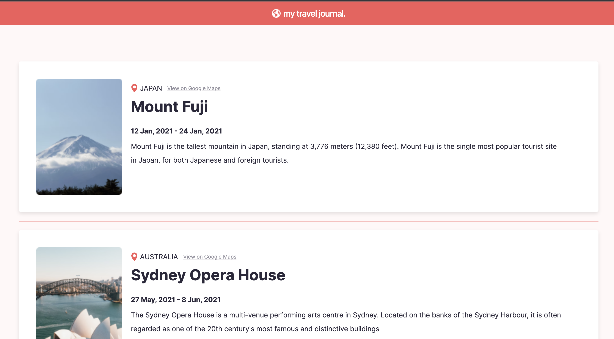

# Travel Journal

This is a solution to the Scrimba Travel Journal based on a [Figma design](https://www.figma.com/file/qnAXFUo1iZm1EwIKYARJWp/Travel-Journal-(Copy)?node-id=2%3A27&mode=dev)  with a few additional features. This project helped to reaffirm my understanding of components and implementation of props.

## Table of contents

- [Overview](#overview)
  - [Requirements](#requirements)
  - [Screenshot](#screenshot)
  - [Links](#links)
  - [Getting Started with Create React App](#getting-started-with-create-react-app)
- [My process](#my-process)
  - [Built with](#built-with)
  - [What I learned](#what-i-learned)
  - [Useful resources](#useful-resources)
- [Author](#author)

## Overview

### Requirements

- Data array in a separate .js file
  - Title, description, price, cover image, rating, review count, location, open spots
- Use .map(), prop, PropTypes
- Style & polished
- Mobile designed 

### Screenshot



### Links

- Live Site URL: [@Netlify](https://stellar-melba-12896b.netlify.app/)
- Solution URL: [@GitHub](https://github.com/WAYD0S/react-travel-journal/tree/master/travel-journal)

### Getting Started with Create React App

This project was bootstrapped with [Vite](https://github.com/vitejs/vite).

## My process

### Built with

- Semantic HTML5 markup
- CSS custom properties
- React.JS
- Flexbox

### What I learned

- I had initially displayed each card with a gap in between. This made it hard to put a spacer in through the margin/border css property. As such a spacer component (Spacer.js) had to be created which would be input above every card component starting from the second card component.

```js
const cards = data.map((item, index) => (
    <React.Fragment key={item.id}>
      {index > 0 && <Spacer />}
      <Card {...item} />
    </React.Fragment>
));
```

- A button was added so that user can switch between the light/dark theme

```css
/* default light mode and dark-mode code */
:root {
    --clr-accent: #f55a5a;
    --ff-main: "Inter", sans-serif;
    
    --clr-card-bg: #fff;
    --clr-text-main: #2b283a;
    --clr-text-light: #fff;
    --clr-background-light: #fff8f8;
  }
  
.dark-mode {
    --clr-card-bg: #2e2e2e;
    --clr-text-main: #ffffff;
    --clr-text-light: #fff;
    --clr-background-light: #2c2b2b;
}
```

- Javascript for light/dark mode button

```js 
//in App.jsx
const [isDarkMode, setIsDarkMode] = useState(false);

const toggleDarkMode = () => {
    setIsDarkMode((prevMode) => !prevMode);
};
.
.
.
<Footer toggleDarkMode = {toggleDarkMode}/>


//in Footer.jsx
const Footer = ({ isDarkMode, toggleDarkMode }) => {
  return (
    <footer>
        <small>Coded by Rishabh Raturi</small>

        {/* Toggle switch for dark mode */}
        <label className="switch">
            <input type="checkbox" checked={isDarkMode} onChange={toggleDarkMode} />
            <span className="slider round"></span>
        </label>
    </footer>
  );
};
```

### Useful resources

- [ReactJS](https://reactjs.org/tutorial/tutorial.html) - How to set up a local development environment on your computer
- [Scrimba](https://scrimba.com/learn/learnreact) - Learn React by practicing

## Author

- Website - [Rishabh Raturi](https://github.com/WAYD0S)
